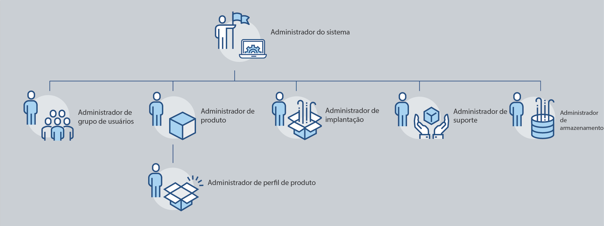

# Funções administrativas

Usando o Adobe Admin Console, as organizações podem definir uma hierarquia administrativa flexível que permite o gerenciamento otimizado do acesso e da utilização dos produtos da Adobe. Um ou mais administradores do sistema, provisionados durante o processo de integração da empresa, estão no topo da hierarquia. Esses administradores do sistema podem delegar responsabilidades a outros administradores, mantendo o controle geral.

As funções administrativas proporcionam os seguintes benefícios principais às empresas:

* Descentralização controlada das responsabilidades administrativas
* Visualização rápida das atribuições de produtos (por usuário e por produto)
* Funcionalidade para atribuir cotas a administradores de produtos

## Hierarquia administrativa

Aplica-se a: clientes empresariais da Adobe.

A hierarquia administrativa pode ser usada para atender aos requisitos exclusivos da sua empresa. Por exemplo, uma empresa pode designar diferentes administradores para gerenciar os direitos às ofertas da Adobe Creative Cloud e da Adobe Marketing Cloud. Alternativamente, uma empresa pode ter diferentes administradores para gerenciar os direitos de usuários que pertencem a diferentes unidades de negócios.

>[!NOTE]
>
>A hierarquia administrativa não se aplica a clientes de equipes. Os clientes de equipes têm uma só função de **Administrador do sistema**. O proprietário do contrato (_anteriormente referido como **Administrador principal**_) é o administrador do sistema que tem acesso aos detalhes do contrato e ao histórico de cobranças. Se você for o proprietário do contrato atual, poderá nomear um administrador do sistema existente (_ anteriormente referido como **administrador secundário**_) como proprietário do contrato.

_Hierarquia de funções administrativas_

| Função | Descrição |
|--- |--- |
| **Administrador do sistema** | Superusuário da organização; pode executar todas as tarefas administrativas no Admin Console. Além disso, tem permissões para delegar as seguintes funcionalidades administrativas a outros usuários: administrador de produtos, administrador de perfis de produtos, administrador de grupos de usuários, administrador de implantação e administrador de suporte. |
| **Administrador de produtos** | Administra os produtos atribuídos a esse administrador e todas as funções administrativas associadas, que incluem:<ul><li>Criar perfis de produtos</li><li>Adicionar usuários e grupos de usuários à organização, mas não removê-los</li><li>Adicionar ou remover usuários e grupos de usuários dos perfis de produtos</li><li>Adicionar ou remover administradores de perfis de produtos</li><li>Adicionar ou remover outros administradores de produtos</li><li>Adicionar ou remover administradores de grupos</li></ul> |
| **Administrador de perfis de produtos** | Administra as descrições dos perfis de produtos atribuídas a ele e todas as funções administrativas associadas, que incluem:<ul><li>Adicionar usuários e grupos de usuários à organização, mas não removê-los</li><li>Adicionar ou remover usuários e grupos de usuários dos perfis de produtos</li><li>Atribuir ou revogar permissões de produtos a usuários e grupos de usuários a partir de perfis de produtos</li><li>Gerenciar funções de usuários e grupos de usuários para perfis de produtos |
| **Administrador de grupos de usuários** | Administra as descrições dos grupos de usuários atribuídas a ele e todas as funções administrativas associadas, que incluem:<ul><li>Adicionar ou remover usuários de grupos</li><li>Adicionar ou remover administradores de grupos de usuários |
| **Administrador de implantação** | Cria, gerencia e implanta pacotes de software e atualizações para os usuários finais. |
| **Administrador de suporte** | Função não administrativa que tem acesso a informações relacionadas a suporte, como relatórios de problemas relatados pelo cliente. |
| **Administrador de armazenamento** | Gerencia a administração de armazenamento da organização. O administrador pode visualizar o consumo de armazenamento por usuários ativos e inativos e transferir o conteúdo para outros destinatários. |

Para obter uma lista detalhada de permissões e privilégios para cada função de administrador, consulte [Permissões](#enterprise-admins-permissions-matrix).

## Adicionar uma função de administrador corporativo {#add-enterprise-role}

Aplica-se a: clientes empresariais da Adobe.

Como administrador, você pode atribuir uma função de administrador a outros usuários, concedendo-lhes os mesmos privilégios que os seus ou privilégios para uma função sob sua função de administrador na hierarquia, conforme descrito [acima](#administrative-hierarchy). Por exemplo, como administrador de produtos, você pode conceder privilégios de administrador de produtos ou privilégios de administrador de perfis de produtos a um usuário, mas não privilégios de administrador de implantação. Para obter as permissões no Admin Console, consulte a [Matriz de permissões](#enterprise-admins-permissions-matrix).

Para adicionar ou convidar um administrador:

1. No [Admin Console](https://adminconsole.adobe.com/), escolha **Usuários** > **Administradores**.

   Como alternativa, acesse o produto, perfil de produtos ou grupo de usuários específico e navegue até a guia **Administradores**.

1. Clique em **Adicionar administrador**.
1. Insira um nome ou endereço de email. Você pode pesquisar usuários existentes ou adicionar um novo usuário especificando um endereço de email válido e preenchendo as informações na tela.
1. Clique em **Próximo**. Uma lista de funções de administrador é exibida.

>[!NOTE]
>
>* As opções dessa tela dependem da sua conta e função de administrador. Você pode conceder os mesmos privilégios que os seus ou privilégios para uma função sob a sua hierarquia.
>* Como administrador do sistema de uma equipe, você pode atribuir somente uma função: administrador do sistema.

1. Selecione uma ou mais funções de administrador.
1. Para tipos de administradores, como administrador de produtos, administrador de perfis de produtos e administrador de grupos de usuários, selecione os produtos, perfis e grupos específicos, respectivamente.

>[!NOTE]
>
>Para um administrador de perfis de produtos, você pode incluir perfis para mais de um produto.

1. Revise as funções de administrador atribuídas ao usuário e clique em **Salvar**.

O usuário recebe um convite por email relacionado aos novos privilégios administrativos de `message@adobe.com`.

Os usuários devem clicar em **Começar** no email para se associarem à organização. Se os novos administradores não usarem o link **Começar** no convite por email, eles não conseguirão acessar o Admin Console.

Como parte do processo de login, os usuários podem ser solicitados a configurar um perfil da Adobe, caso ainda não tenham um. Se os usuários tiverem vários perfis associados ao endereço de email, eles deverão escolher &quot;Associar-se à equipe&quot; (se solicitado) e selecionar o perfil associado à nova organização.

## Adicionar um administrador de equipes {#add-admin-teams}

Aplica-se a: clientes de equipes da Adobe.

Como administrador, você pode atribuir a função de administrador do sistema a outros usuários, concedendo-lhes os mesmos privilégios que os seus.

Para adicionar ou convidar um administrador do sistema:

1. No Admin Console, escolha **Usuários** > **Administradores**.

   Uma lista de administradores existentes é exibida.

1. Clique em **Adicionar administrador**.

   A tela **Adicionar um administrador** é exibida.

1. Insira um nome ou endereço de email. Você pode pesquisar usuários existentes ou adicionar um novo usuário especificando um endereço de email válido e preenchendo as informações na tela.

   Por padrão, Administrador do sistema é selecionado.

1. Clique em **Salvar**.

Como todos os usuários em uma organização de equipes são usuários com IDs de empresa, eles recebem um convite por email relacionado aos novos privilégios administrativos de `message@adobe.com`.
Os usuários devem clicar em Começar no email para se associarem à organização.

Como parte do processo de login, os usuários podem ser solicitados a configurar um perfil da Adobe, caso ainda não tenham um. Se os usuários tiverem vários perfis associados ao endereço de email, eles deverão escolher &quot;Associar-se à equipe&quot; (se solicitado) e selecionar o perfil associado à nova organização.

## Editar função de administrador empresarial

Aplica-se a: clientes empresariais da Adobe.

Como administrador, você pode editar a função de administrador para outros administradores que estão abaixo de você na hierarquia administrativa. Por exemplo, você pode remover privilégios de administrador de outros administradores.

Para editar funções de administrador:

1. No Admin Console, escolha **Usuários** > **Administradores**. A lista de administradores existentes é exibida.

   Como alternativa, acesse o produto, perfil de produtos ou grupo de usuários específico e navegue até a guia **Administradores**.

1. Clique no nome do administrador para editar.
1. Em **Detalhes do usuário**, clique no  da seção **Direitos do administrador** e escolha **Editar direitos do administrador**.

   

1. Edite os direitos do administrador e salve as alterações.

## Editar função de administrador de equipes

Aplica-se a: clientes de equipes da Adobe.

Como administrador do sistema de equipes, você pode remover os privilégios de administrador do sistema de outros administradores.

Para revogar privilégios de administrador do sistema:

1. No Admin Console, escolha **Usuários** > **Administradores**.

   A lista de administradores existentes é exibida.

1. Em Detalhes do usuário, clique no  à direita da seção **Direitos do administrador** e escolha **Editar direitos do administrador**.

   

1. Edite os direitos do administrador e salve as alterações.

## Remover um administrador

Aplica-se a: clientes empresariais com equipes da Adobe.

1. Para revogar permissões de administrador, selecione um usuário e clique em **Remover administrador**.

>[!NOTE]
>
>Ao remover um administrador, o usuário não é excluído do Admin Console, apenas os privilégios associados à função de administrador são removidos.

## Matriz de permissões para administradores empresariais

Aplica-se a: clientes empresariais da Adobe.

A tabela a seguir lista todas as permissões para os diferentes tipos de administradores, categorizadas pelas seguintes áreas de funcionalidade:

### Gerenciamento de identidade

| Permissão | Administrador do sistema | Administrador de suporte |
|--- |--- |--- |
| Adicionar domínio (solicitar/reivindicar um domínio) | ✔ | |
| Exibir domínios e listas de domínios | ✔ | |
| Gerenciar chaves de criptografia de domínios | ✔ | |
| Gerenciar a política padrão de senhas da organização | ✔ | |
| Exibir a política padrão de senhas da organização | ✔ | |

### Gerenciamento de usuários

| Permissão | Administrador do sistema | Administrador de suporte |
|--- |--- |--- |
| Adicionar usuário à organização | ✔ | |
| Remover usuário da organização | ✔ | |
| Exibir detalhes e listas de usuários | ✔ | |
| Editar perfis de usuários | ✔ | |
| Adicionar perfis de produtos a usuários ou grupos | ✔ | |
| Remover perfis de produtos a usuários ou grupos | ✔ | |
| Adicionar perfis de produtos a vários usuários | ✔ | |
| Exibir perfis de produtos para um usuário | ✔ | |
| Exibir a lista de usuários do produto | ✔ | |
| Adicionar usuários em massa à organização | ✔ | |

### Gerenciamento de administradores

| Permissão | Administrador do sistema | Administrador de suporte |
|--- |--- |--- |
| Conceder permissões de administrador da organização a um usuário | ✔ | |
| Revogar permissões de administrador da organização de um usuário | ✔ | |
| Conceder permissões de administrador de licenças de produtos a um usuário | ✔ | |
| Revogar permissões de administrador de licenças de produtos de um usuário | ✔ | |
| Conceder permissões de administrador de implantação a um usuário | ✔ | |
| Revogar permissões de administrador de implantação de um usuário | ✔ | |
| Conceder permissões de administrador de grupos de usuários a um usuário | ✔ | |
| Revogar permissões de administrador de grupos de usuários a um usuário | ✔ | |
| Conceder permissões de administrador de proprietários de produtos a um usuário | ✔ | |
| Revogar permissões de administrador de proprietários de produtos de um usuário | ✔ | |

### Gerenciamento de configurações de licenças de produtos

| Permissão | Administrador do sistema | Administrador de suporte |
|--- |--- |--- |
| Conceder direitos do produto à organização | | |
| Remover direitos do produto da organização | | |
| Exibir o número total de licenças que a organização possui | ✔ | |
| Exibir produtos e famílias de produtos disponíveis | ✔ | |
| Editar descrições/dados de licenças de produtos | ✔ | |
| Provisionar licenças de produtos para um usuário | ✔ | |
| Desprovisionar licenças de produtos de um usuário | ✔ | |
| Adicionar nova configuração de licença de produto | ✔ | |
| Editar configuração do serviço de licenças de produtos | ✔ | |
| Excluir configuração do serviço de licenças de produtos | ✔ | |
| Remover o acesso ao produto de um usuário (eliminar de todas as configurações) | ✔ | |

### Gerenciamento de armazenamento

| Permissão | Administrador do sistema | Administrador de suporte |
|--- |--- |--- |
| Exibir pastas de usuários ativos e inativos | ✔ | |
| Excluir pastas de usuários inativos e transferir o conteúdo | ✔ | |

### Implantação

| Permissão | Administrador do sistema | Administrador de suporte |
|--- |--- |--- |
| Exibir/usar a guia Pacotes | ✔ | |

### Suporte

| Permissão | Administrador do sistema | Administrador de suporte |
|--- |--- |--- |
| Exibir a guia Suporte | ✔ | |
| Gerenciar casos de suporte | ✔ | ✔ |

### Gerenciamento de grupos de usuários

| Permissão | Administrador do sistema | Administrador de suporte |
|--- |--- |--- |
| Criar grupos de usuários | ✔ | |
| Remover grupos de usuários | ✔ | |
| Adicionar usuários a um grupo de usuários | ✔ | |
| Remover usuários de um grupo de usuários | ✔ | |
| Atribuir grupos de usuários a licenças de produtos | ✔ | |
| Remover grupos de usuários de licenças de produtos | ✔ | |
| Exibir membro de um grupo de usuários | ✔ | ✔ |
| Exibir listas de grupos de usuários | ✔ | ✔ |
