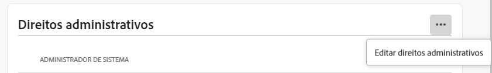

# Funções administrativas

Usando a Adobe Admin Console, as organizações podem definir uma hierarquia administrativa flexível que permite o gerenciamento refinado do acesso e uso do produto Adobe. Um ou mais administradores do Sistema, provisionados durante o processo de integração empresarial, ficam no topo da hierarquia. Esses administradores do Sistema podem delegar responsabilidades a outros administradores, mantendo o controle geral.

As funções administrativas proporcionam os seguintes benefícios principais às empresas:

* descentralização controlada das responsabilidades administrativas
* Visualização rápida das atribuições de produtos — por usuário e por produto
* Funcionalidade para atribuir cotas a administradores de produtos

## Hierarquia administrativa

Aplica-se a: Clientes empresariais Adobe.

A hierarquia administrativa pode ser usada para atender aos requisitos exclusivos de sua empresa. Por exemplo, uma empresa pode designar diferentes administradores para gerenciar direitos às ofertas da Adobe Creative Cloud e da Adobe Marketing Cloud. Alternativamente, uma empresa pode ter diferentes administradores para gerenciar direitos de usuários pertencentes a diferentes unidades de negócios.

>[!NOTE]
>
>A hierarquia administrativa não se aplica a clientes de equipes. Os clientes de equipes têm um único **Administrador do sistema** função. O proprietário do contrato (_anteriormente referidas como **Administrador principal**_) é o administrador do sistema com acesso aos detalhes do contrato e ao histórico de cobrança. Se você for o proprietário do contrato atual, poderá nomear um administrador do sistema existente (_ anteriormente referidas como **administrador secundário**_) como proprietário do contrato.

_Hierarquia de funções administrativas_

| Função | Descrição |
|--- |--- |
| **Administrador do sistema** | Superusuário da organização; permitido executar todas as tarefas administrativas no Admin Console. Além disso, o tem permissões para delegar a seguinte funcionalidade administrativa a outros usuários: Administrador de produto, administrador de Perfil de produto, administrador de grupo de usuários, administrador de implantação e administrador de suporte. |
| **Administrador de produto** | Administra os produtos atribuídos a esse administrador e todas as funções administrativas associadas, que incluem:<ul><li>Criar perfis de produto</li><li>Adicionar usuários e grupos de usuários à organização, mas não removê-los</li><li>Adicionar ou remover usuários e grupos de usuários dos perfis de produtos</li><li>Adicionar ou remover administradores de Perfil de produto dos perfis de produto</li><li>Adicionar ou remover outros administradores de produto do produto</li><li>Adicionar ou remover administradores de grupo de grupos</li></ul> |
| **Administrador do perfil do produto** | Administra as descrições do Perfil do Produto atribuídas a esse administrador e todas as funções administrativas associadas, que incluem:<ul><li>Adicionar usuários e grupos de usuários à organização, mas não removê-los</li><li>Adicionar ou remover usuários e grupos de usuários dos perfis de produtos</li><li>Atribuir ou revogar permissões de produto a usuários e grupos de usuários a partir de perfis de produtos</li><li>Gerenciar funções de produto de usuários e grupos de usuários para perfis de produtos |
| **Administrador do grupo de usuários** | Administra as descrições do grupo de usuários atribuídas a esse administrador e todas as funções administrativas associadas, que incluem:<ul><li>Adicionar ou remover usuários de grupos</li><li>Adicionar ou remover administradores de grupos de usuários de grupos |
| **Administrador de implantação** | Cria, gerencia e implanta pacotes de software e atualizações para os usuários finais. |
| **Administrador de suporte** | Função não administrativa que tem acesso a informações relacionadas ao suporte, como relatórios de problemas relatados pelo cliente. |
| **Administrador de armazenamento** | Gerencia a administração de armazenamento da organização. O administrador pode visualizar o consumo de armazenamento de usuários ativos e inativos e transferir conteúdo para outros recipients. |

Para obter uma lista detalhada de permissões e privilégios para cada função de administrador, consulte [Permissões](#enterprise-admins-permissions-matrix).

## Adicionar um administrador corporativo

Aplica-se a: Clientes empresariais Adobe.

Como administrador, você pode atribuir uma função de administrador a outros usuários, concedendo-lhes os mesmos privilégios que possui, ou privilégios para uma função sob sua função de administrador na hierarquia, conforme descrito em [above](#administrative-hierarchy). Por exemplo, como administrador de produto, você pode conceder privilégios de administrador de produto ou privilégios de administrador de Perfil de produto a um usuário, mas não privilégios de administrador de Implantação. Para obter as permissões no Admin Console, consulte o [Matriz de permissões](#enterprise-admins-permissions-matrix).

Para adicionar ou convidar um administrador:

1. No [Admin Console](https://adminconsole.adobe.com/), escolha **Usuários** > **Administradores**.

   Como alternativa, acesse o Produto, Perfil de Produto ou Grupo de Usuários relevante e navegue até o **Administradores** guia .

1. Clique em **Adicionar administrador**.
1. Insira um nome ou endereço de email. Você pode pesquisar usuários existentes ou adicionar um novo usuário especificando um endereço de email válido e preenchendo as informações na tela.
1. Clique em **Próximo**. Uma lista de funções de administrador é exibida.

>[!NOTE]
>
>* As opções nessa tela dependem da sua conta e função de administrador. Você pode conceder os mesmos privilégios que tem ou privilégios para uma função sob a sua hierarquia.
>* Como Administrador do sistema de uma equipe, você pode atribuir somente uma função de administrador: Administrador do sistema

1. Selecione uma ou mais funções de administrador.
1. Para tipos de administradores como Administrador de produto, Administrador de perfil de produto e Administrador de grupo de usuários, selecione os produtos, perfis e grupos específicos, respectivamente.

>[!NOTE]
>
>Para um Administrador de perfil de produto, você pode incluir perfis para mais de um produto.

1. Revise as funções de administrador atribuídas ao usuário e clique em **Salvar**.

O usuário recebe um convite por email relacionado aos novos privilégios administrativos de `message@adobe.com`.

Os usuários devem clicar em **Introdução** no email para ingressar na organização. Se novos administradores não usarem o **Introdução** no convite por email, eles não conseguiriam entrar no Admin Console.

Como parte do processo de logon, os usuários podem ser solicitados a configurar um perfil do Adobe, caso ainda não o tenham. Se os usuários tiverem vários perfis associados ao endereço de email, eles deverão escolher &quot;Associar-se à equipe&quot; (se solicitado) e selecionar o perfil associado à nova organização.

## Adicionar um administrador de equipes {#add-admin-teams}

Aplica-se a: Clientes de equipes Adobe.

Como administrador, você pode atribuir a função de administrador do Sistema a outros usuários, concedendo-lhes os mesmos privilégios que possui.

Para adicionar ou convidar um administrador do sistema:

1. No Admin Console, escolha **Usuários** > **Administradores**.

   Uma lista de administradores existentes é exibida.

1. Clique em **Adicionar administrador**.

   O **Adicionar um administrador** será exibida.

1. Insira um nome ou endereço de email. Você pode pesquisar usuários existentes ou adicionar um novo usuário especificando um endereço de email válido e preenchendo as informações na tela.

   Por padrão, o Administrador do sistema é selecionado.

1. Clique em **Salvar**.

Como todos os usuários em uma organização de equipes são usuários de ID de negócios, eles recebem um convite por email relacionado aos novos privilégios administrativos de `message@adobe.com`.
Os usuários devem clicar em Começar no email para ingressar na organização.

Como parte do processo de logon, os usuários podem ser solicitados a configurar um perfil do Adobe, caso ainda não o tenham. Se os usuários tiverem vários perfis associados ao endereço de email, eles deverão escolher &quot;Associar-se à equipe&quot; (se solicitado) e selecionar o perfil associado à nova organização.

## Editar função de administrador corporativo

Aplica-se a: Clientes empresariais Adobe.

Como administrador, você pode editar a função de administrador para outros administradores que estão abaixo de você na hierarquia Administrativa. Por exemplo, você pode remover privilégios de administrador de outros administradores.

Para editar funções de administrador:

1. No Admin Console, escolha **Usuários** > **Administradores**. A lista de administradores existentes é exibida.

   Como alternativa, acesse o Produto, Perfil de Produto ou Grupo de Usuários relevante e navegue até o **Administradores** guia .

1. Clique no nome do administrador para editar.
1. No **Detalhes do usuário**, clique em  para **Direitos administrativos** e escolha **Editar direitos administrativos**.

   

1. Edite os direitos administrativos e salve as alterações.

## Editar função de administrador de equipes

Aplica-se a: Clientes de equipes Adobe.

Como administrador do Sistema de equipes, você pode remover os privilégios de administrador do Sistema de outros administradores.

Para revogar privilégios de administrador do sistema:

1. No Admin Console, escolha **Usuários** > **Administradores**.

   A lista de administradores existentes é exibida.

1. Em Detalhes do usuário, clique em  à direita do **Direitos administrativos** e escolha **Editar direitos administrativos**.

   

1. Edite os direitos administrativos e salve as alterações.

## Remover um administrador

Aplica-se a: Adobe equipes de clientes empresariais.

1. Para revogar permissões de administrador, selecione um usuário e clique em **Remover administrador**.

>[!NOTE]
>
>Remover um administrador não exclui o usuário do Admin Console, mas remove apenas os privilégios associados à função de administrador.

## Matriz de permissões de administradores empresariais

Aplica-se a: Clientes empresariais Adobe.

A tabela a seguir lista todas as permissões para os diferentes tipos de administradores, categorizadas pelas seguintes áreas de funcionalidade:

### Gerenciamento de identidade

| Permissão | Administrador do sistema | Administrador de suporte |
|--- |--- |--- |
| Adicionar domínio (solicitar/reivindicar um domínio) | ✔ |  |
| Exibir listagem de domínio e domínio | ✔ |  |
| Gerenciar chaves de criptografia de domínio | ✔ |  |
| Gerenciar a política padrão de senha da organização | ✔ |  |
| Exibir política padrão de senha da organização | ✔ |  |

### Gerenciamento do usuário

| Permissão | Administrador do sistema | Administrador de suporte |
|--- |--- |--- |
| Adicionar usuário à organização | ✔ |  |
| Remover usuário da organização | ✔ |  |
| Exibir detalhes e listagem do usuário | ✔ |  |
| Editar perfil de usuário | ✔ |  |
| Adicionar perfil de produto ao usuário ou grupo | ✔ |  |
| Remover Perfil de Produto ao usuário ou grupo | ✔ |  |
| Adicionar perfil de produto a vários usuários | ✔ |  |
| Exibir perfis de produto para um usuário | ✔ |  |
| Exibir lista de usuários do produto | ✔ |  |
| Adicionar usuários em massa à organização | ✔ |  |

### Gerenciamento de administradores

| Permissão | Administrador do sistema | Administrador de suporte |
|--- |--- |--- |
| Conceder Org Admin a um usuário | ✔ |  |
| Revogar Org Admin de um usuário | ✔ |  |
| Conceder administrador de licença de produto a um usuário | ✔ |  |
| Revogar o administrador da licença de produto de um usuário | ✔ |  |
| Conceder administrador de implantação a um usuário | ✔ |  |
| Revogar Administrador de Implantação de um usuário | ✔ |  |
| Conceder administrador de grupo de usuários a um usuário | ✔ |  |
| Revogar o administrador do grupo de usuários de um usuário | ✔ |  |
| Conceder administrador do proprietário do produto a um usuário | ✔ |  |
| Revogar o administrador do proprietário do produto de um usuário | ✔ |  |

### Gerenciamento de configuração de licença de produto

| Permissão | Administrador do sistema | Administrador de suporte |
|--- |--- |--- |
| Conceder direito ao produto para organização |  |  |
| Remover o direito do produto da organização |  |  |
| Exibir o número total de licenças de propriedade da organização | ✔ |  |
| Exibir produtos e famílias de produtos disponíveis | ✔ |  |
| Editar descrições/dados de licença do produto | ✔ |  |
| Provisionar licença de produto para um usuário | ✔ |  |
| Desprovisionar a licença de produto de um usuário | ✔ |  |
| Adicionar nova configuração de licença de produto | ✔ |  |
| Editar configuração do serviço de licença do produto | ✔ |  |
| Excluir configuração do serviço de licença do produto | ✔ |  |
| Remover o acesso ao produto de um usuário (retirar de todas as configurações) | ✔ |  |

### Gerenciamento de armazenamento

| Permissão | Administrador do sistema | Administrador de suporte |
|--- |--- |--- |
| Exibir pastas de usuário ativas e inativas | ✔ |  |
| Excluir pastas de usuário inativas e transferir conteúdo | ✔ |  |

### Implantação

| Permissão | Administrador do sistema | Administrador de suporte |
|--- |--- |--- |
| Guia Exibir/usar pacotes | ✔ |  |

### Suporte

| Permissão | Administrador do sistema | Administrador de suporte |
|--- |--- |--- |
| Exibir guia Suporte | ✔ |  |
| Gerenciar casos de suporte | ✔ | ✔ |

### Gerenciamento de grupos de usuários

| Permissão | Administrador do sistema | Administrador de suporte |
|--- |--- |--- |
| Criar grupo de usuários | ✔ |  |
| Remover grupo de usuários | ✔ |  |
| Adicionar usuário ao grupo de usuários | ✔ |  |
| Remover usuário do grupo de usuários | ✔ |  |
| Atribuir grupo de usuários à licença de produto | ✔ |  |
| Remover grupo de usuários da licença de produto | ✔ |  |
| Exibir membro do grupo de usuários | ✔ | ✔ |
| Exibir lista de grupos de usuários | ✔ | ✔ |
