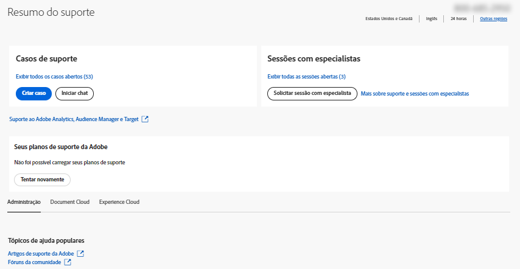

# Empresas e equipes | Entre em contato com o Atendimento ao Cliente Adobe

Para entrar em contato com o Atendimento ao cliente do Adobe, navegue até o **Suporte** na guia no [Admin Console](https://adminconsole.adobe.com/).

O **Guia Suporte** no [Admin Console](https://adminconsole.adobe.com/) permite acessar várias opções de suporte por meio de uma interface simples e fácil de usar. As opções disponíveis na guia Suporte dependem do seu plano de assinatura. Para obter mais informações, clique em **Saiba mais** correspondente ao seu plano de assinatura.

Se não tiver certeza sobre o plano de assinatura, navegue até o **Guia Suporte** no [Admin Console](https://adminconsole.adobe.com/)e compare sua visualização com as imagens abaixo. Em seguida, clique no **Saiba mais** link .

## Para conta de equipes

[Saiba mais](https://helpx.adobe.com/enterprise/using/support-for-teams.html)

## Para conta de empresa

[Saiba mais](https://helpx.adobe.com/enterprise/using/support-for-enterprise.html)

## Para Experience Cloud

[Saiba mais](https://www.adobe.com/go/ac_ec_not_supported_en)
