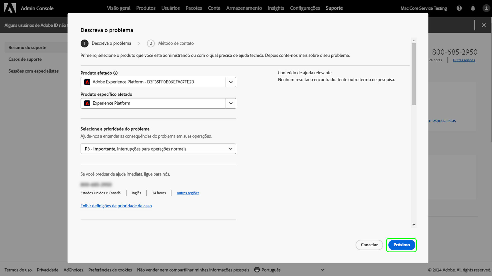

# Experiência de Suporte ao Cliente Adobe

## Tíquetes de suporte do Admin Console

Agora, os tíquetes de suporte podem ser enviados por meio do [Admin Console](https://adminconsole.adobe.com/). Para obter instruções sobre como enviar um tíquete de suporte, consulte a seção para [enviar um tíquete de suporte](#submit-ticket).

Conforme compartilhado anteriormente, estamos trabalhando para melhorar a interação com o Suporte ao cliente do Adobe, começando pelo Adobe Experience Manager e pelo Campaign. Nosso objetivo é simplificar a experiência de suporte, mudando para um único ponto de entrada, usando a Adobe Admin Console. Assim que o novo Suporte ao cliente do Adobe estiver funcionando, sua organização poderá acessar facilmente o Suporte ao cliente do; ter maior visibilidade do histórico de serviços por meio de um sistema comum entre produtos; e solicitar ajuda por telefone, Web e bate-papo por meio de um único portal.

## Como enviar um tíquete de suporte do Admin Console {#submit-ticket}

Para enviar um tíquete de suporte em [Admin Console](https://adminconsole.adobe.com/), é necessário ter a função de administrador de suporte atribuída por um Administrador do sistema. Somente um Administrador de sistema da organização pode atribuir essa função. Produto, Perfil de Produto e outras funções administrativas não podem atribuir a função de administrador de Suporte e não podem visualizar a opção **[!UICONTROL Criar Caso]** usada para enviar um tíquete de suporte. Para obter mais informações, visite a documentação do [atendimento ao cliente de equipes e empresas](https://helpx.adobe.com/enterprise/using/support-and-expert-services.html).

### Atribuir a função de administrador de suporte

A função de administrador de suporte é uma função não administrativa que tem acesso a informações relacionadas ao suporte. Administradores de suporte podem visualizar, criar e gerenciar relatórios de problemas.

Para atribuir a função de administrador do Suporte, siga as instruções [editar função de administrador corporativo](https://helpx.adobe.com/enterprise/using/admin-roles.html#add-admin-teams) na documentação de funções administrativas. Observe que somente um administrador de sistema da sua organização pode atribuir essa função. Para obter mais informações sobre hierarquia administrativa, visite a documentação [funções administrativas](https://helpx.adobe.com/enterprise/admin-guide.html/enterprise/using/admin-roles.ug.html).

### Criar um tíquete de suporte com o Admin Console

Para criar um tíquete usando [Admin Console](https://adminconsole.adobe.com/), selecione a guia **[!UICONTROL Support]** localizada na navegação superior. A página [!UICONTROL Resumo do Suporte] é exibida. Em seguida, selecione a opção **[!UICONTROL Criar caso]**.

>[!TIP]
>
> Se não conseguir ver a opção **[!UICONTROL Criar Caso]** ou a guia **[!UICONTROL Suporte]**, é necessário entrar em contato com um Administrador do Sistema para atribuir a função de administrador de Suporte.

Uma caixa de diálogo é exibida, permitindo que você selecione um tipo de problema. Selecione o tipo de problema que melhor descreve seu problema ou pergunta e selecione **[!UICONTROL Criar Caso]** no canto inferior direito.

A caixa de diálogo **[!UICONTROL Criar caso]** é exibida. Você deve fornecer algumas informações, como produto, prioridade, descrição e anexar quaisquer capturas de tela para ajudar a descrever o problema. Selecione **[!UICONTROL Next]** para continuar.

>[!NOTE]
>
> Se o problema resultar em paralisações ou interrupções extremamente graves em um sistema de produção, um número de telefone é fornecido para assistência imediata.

A próxima página permite que você preencha as informações de contato e forneça o melhor horário para que o Suporte ao cliente do Adobe entre em contato com você. Depois de concluído, selecione **[!UICONTROL Submit]** no canto inferior direito e seu ticket será enviado ao Suporte ao cliente do Adobe.

## E os sistemas herdados?

Não será mais possível enviar novos tíquetes/casos em sistemas antigos a partir de 11 de maio.  O [Admin Console](https://adminconsole.adobe.com/) será usado para enviar novos tíquetes/casos.

### Tíquetes/casos existentes

* Entre os dias 11 e 20 de maio, os sistemas herdados permanecerão disponíveis para trabalhar com tíquetes/casos existentes até a conclusão.
* A partir de 20 de maio, a equipe de suporte migrará os casos restantes abertos dos sistemas herdados para a nova experiência de suporte.  Você receberá uma notificação por email sobre como entrar em contato com o suporte para continuar trabalhando nesses casos.

### Histórico de casos

O histórico de casos fechados estará visível para a equipe de suporte do Adobe.  Se precisar de ajuda com relação a um caso fechado, consulte a seção Precisa de ajuda? abaixo.

## Precisa de ajuda?

Depois do lançamento, se você encontrar problemas e não conseguir fazer logon na nova ferramenta, terá as seguintes opções:

### Opção 1: Enviar um tíquete

Entre em contato conosco registrando um tíquete de [Experience League](https://experienceleague.adobe.com/?support-solution=General#support) e incluindo:

* Informações de contato: Nome, endereço de email, telefone
* Nome da empresa
* Produto Adobe próprio
* Prioridade do problema
* Breve descrição do problema

### Opção 2: Antes de 11 de maio

Antes de 11 de maio, você ainda pode usar os sistemas de gerenciamento de casos [Campaign Extranet](https://support.neolane.net/webApp/extranetLogin) ou [Experience Manager Daycare](https://daycare.day.com/home.html) herdados.  A partir de 11 de maio, você será redirecionado para o [Admin Console](https://adminconsole.adobe.com/), pois esses sistemas não aceitarão novos casos.

Para dúvidas relacionadas a este email, registre um tíquete em [Experience League](https://experienceleague.adobe.com/?support-solution=General#support).
