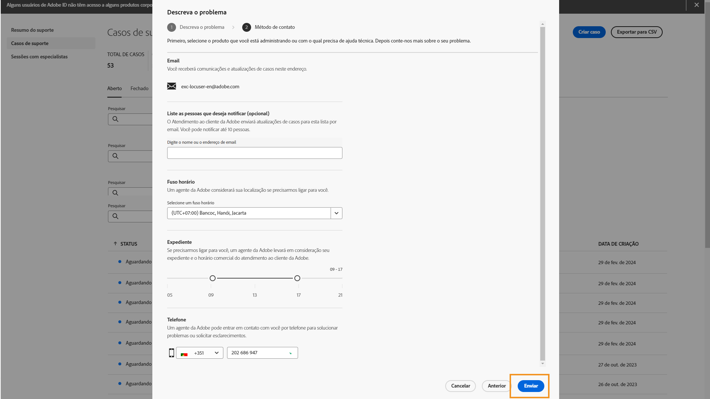

# Experiência de Suporte ao cliente da Adobe

## Tíquetes de suporte do Admin Console

Agora, os tíquetes de suporte podem ser enviados pelo [Admin Console](https://adminconsole.adobe.com/). Para obter instruções sobre como enviar um tíquete de suporte, consulte a seção de [envio de um tíquete de suporte](#submit-ticket).

Conforme informado anteriormente, estamos trabalhando para melhorar sua interação com o Suporte ao cliente da Adobe, começando pelo Adobe Experience Manager e pelo Campaign. Nosso objetivo é simplificar a experiência de suporte, mudando para um ponto de acesso centralizado, usando o Adobe Admin Console. Assim que o novo Suporte ao cliente da Adobe estiver funcionando, sua organização terá uma maior visibilidade do histórico de serviços em um mesmo sistema para os produtos e poderá solicitar ajuda por telefone, chat ou site, tudo em um só portal.

## Como enviar um tíquete de suporte do Admin Console {#submit-ticket}

Para enviar um tíquete de suporte no [Admin Console](https://adminconsole.adobe.com/), é necessário que um Administrador do sistema atribua a função de administrador de suporte a você. Somente um Administrador de sistema da sua organização pode atribuir essa função. Produto, Perfil de produto e outras funções administrativas não podem atribuir a função de administrador de suporte e não conseguem visualizar a opção **[!UICONTROL Criar caso]** usada para enviar um tíquete de suporte. Para obter mais informações, visite a documentação sobre [atendimento ao cliente de empresas e equipes](https://helpx.adobe.com/br/enterprise/using/support-and-expert-services.html).

### Atribuir a função de administrador de suporte

A função de administrador de suporte é uma função não administrativa que tem acesso a informações relacionadas ao suporte. Os administradores de suporte podem visualizar, criar e gerenciar relatórios de problemas.

Para atribuir a função de administrador de suporte, siga as instruções para [editar a função de administrador corporativo](https://helpx.adobe.com/br/enterprise/using/admin-roles.html#add-admin-teams

) na documentação de funções administrativas. Tenha em mente que essa função só poderá ser atribuída por um administrador de sistema da sua organização. Para obter mais informações sobre a hierarquia administrativa, visite a documentação sobre [funções administrativas](https://helpx.adobe.com/br/enterprise/admin-guide.html/enterprise/using/admin-roles.ug.html).

### Criar um tíquete de suporte com o Admin Console

Para criar um tíquete usando o [Admin Console](https://adminconsole.adobe.com/), selecione a guia **[!UICONTROL Suporte]** localizada na navegação superior. A página [!UICONTROL Resumo do suporte] será exibida. Em seguida, selecione a opção **[!UICONTROL Criar caso]**.

>[!TIP]
>
> Se você não conseguir ver a opção **[!UICONTROL Criar caso]** ou a guia **[!UICONTROL Suporte]**, entre em contato com um Administrador do sistema para que ele atribua a função de administrador de suporte a você.

Uma caixa de diálogo será exibida para que você selecione um tipo de problema. Selecione o tipo que melhor descreva seu problema ou pergunta e selecione **[!UICONTROL Criar caso]** na parte inferior direita.

A caixa de diálogo **[!UICONTROL Criar caso]** será exibida. Você deve fornecer algumas informações, como produto, prioridade e descrição, e anexar quaisquer capturas de tela que possam ajudar a descrever o problema. Selecione **[!UICONTROL Próximo]** para continuar.

>[!NOTE]
>
> Se o problema resultar em paralisações ou interrupções extremamente graves em um sistema de produção, será fornecido um número de telefone para assistência imediata.

A próxima página permite que você preencha as informações de contato e forneça o melhor horário para que o Suporte ao cliente do Adobe entre em contato com você. Depois de concluir, selecione **[!UICONTROL Enviar]** na parte inferior direita, e seu tíquete será enviado ao Suporte ao cliente da Adobe.

## E quanto aos sistemas herdados?

Não será mais possível enviar novos tíquetes/casos em sistemas antigos a partir de 11 de maio.  O [Admin Console](https://adminconsole.adobe.com/) será usado para enviar novos tíquetes/casos.

### Tíquetes/casos existentes

* Entre os dias 11 e 20 de maio, os sistemas herdados permanecerão disponíveis para trabalhos com tíquetes/casos existentes até a conclusão.
* A partir de 20 de maio, a equipe de suporte migrará os casos que continuarem abertos nos sistemas herdados para a nova experiência de suporte.  Você receberá uma notificação por email referente a como entrar em contato com o suporte para continuar trabalhando nesses casos.

