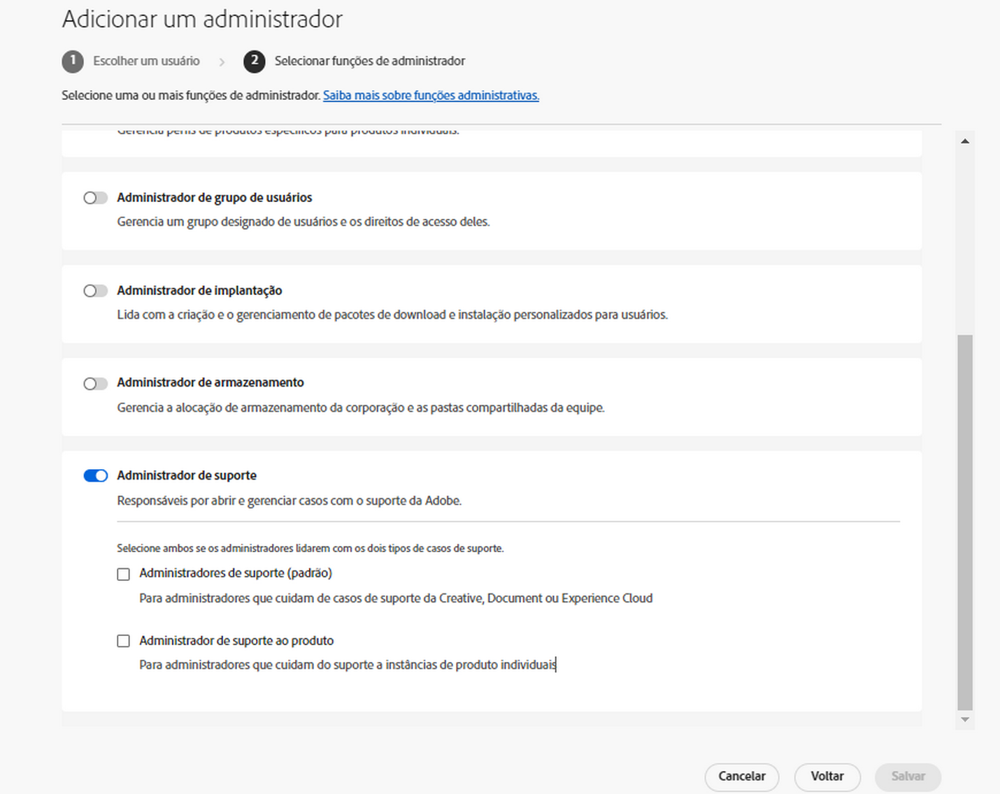

# Experiência de Suporte ao cliente da Adobe

## Tíquetes de suporte da Experience League

Os tíquetes de suporte agora são enviados pela [Experience League](https://experienceleague.adobe.com/home?lang=pt-BR#support). Para obter instruções sobre como enviar um tíquete de suporte, consulte a seção de [envio de um tíquete de suporte](#submit-ticket).

Estamos trabalhando para melhorar a interação com o Suporte ao cliente do Adobe. Nosso objetivo é simplificar a experiência de suporte, mudando para um ponto de acesso centralizado, usando a Experience League. Assim que o novo Suporte ao cliente da Adobe estiver funcionando, sua organização terá uma maior visibilidade do histórico de serviços em um mesmo sistema para os produtos e poderá solicitar ajuda por telefone, chat ou site, tudo em um só portal.

Se você for usuário do Adobe Commerce, consulte [Enviar um caso de suporte](https://experienceleague.adobe.com/pt-br/docs/commerce-knowledge-base/kb/help-center-guide/magento-help-center-user-guide#support-case) no Guia do usuário de suporte da Experience League para Adobe Commerce.

## Funções de suporte qualificadas necessárias para o envio de caso {#submit-ticket}

Para enviar um tíquete de suporte na [Experience League](https://experienceleague.adobe.com/home?lang=pt-BR#support), é necessário que um Administrador do sistema atribua a função de administrador de suporte a você. Somente um Administrador de sistema da sua organização pode atribuir essa função. Produto, Perfil de produto e outras funções administrativas não podem atribuir a função de administrador de suporte e não conseguem visualizar a opção **[!UICONTROL Criar caso]** usada para enviar um tíquete de suporte. Para saber mais sobre os diferentes tipos de funções de administrador e seus direitos, consulte [Funções de administrador](admin-roles.md).

Se você estiver no Commerce, o processo para compartilhar o acesso para trabalhar com casos de suporte será diferente. Para saber mais, consulte [Acesso compartilhado: conceder privilégios para que outros usuários acessem sua conta](https://experienceleague.adobe.com/pt-br/docs/commerce-knowledge-base/kb/help-center-guide/magento-help-center-user-guide#shared-access) no Guia do usuário de suporte da Experience League para Adobe Commerce.

### Adicionar funções de direitos de suporte a uma organização

A função de administrador de suporte é uma função não administrativa que tem acesso a informações relacionadas ao suporte. Os administradores de suporte podem visualizar, criar e gerenciar relatórios de problemas.

Para adicionar ou convidar um administrador:

1. No Admin Console, escolha **[!UICONTROL Usuários]** > **[!UICONTROL Administradores]**.
1. Clique em **[!UICONTROL Adicionar administrador]**.
1. Insira um nome ou endereço de email.

   Você pode pesquisar usuários existentes ou adicionar um novo usuário especificando um endereço de email válido e preenchendo as informações na tela.

   

1. Clique em **[!UICONTROL Próximo]**. Uma lista de funções de administrador é exibida.

Para atribuir uma função de Administrador de suporte a um usuário (permitir que um usuário entre em contato com o suporte):

1. Selecione a opção **[!UICONTROL Administrador de suporte]**.

   

1. Escolha entre as duas opções a seguir:

   * Opção 1: **[!UICONTROL Administrador de suporte básico]**. Selecione essa opção se quiser fornecer ao usuário acesso de suporte a todas as soluções (exceto ao Marketo Engage).
   * Opção 2: **[!UICONTROL Administrador de suporte do produto]**: selecione essa opção para fornecer suporte ao Marketo Engage. Selecione as instâncias do Marketo Engage às quais o usuário deve receber acesso de suporte.

   

1. Depois de escolher as opções desejadas, clique em **[!UICONTROL Salvar]**.

O usuário recebe um convite por email relacionado aos novos privilégios administrativos de `message@adobe.com`.

Os usuários devem clicar em **Começar** no email para se associarem à organização. Se os novos administradores não usarem o link **Começar** no convite por email, eles não conseguirão acessar o Admin Console.

Como parte do processo de login, os usuários podem ser solicitados a configurar um perfil da Adobe, caso ainda não tenham um. Se os usuários tiverem vários perfis associados ao endereço de email, eles deverão escolher **Associar-se à equipe** (se solicitado) e selecionar o perfil associado à nova organização.

Para obter mais detalhes, siga as instruções para [editar a função de administrador corporativo](admin-roles.md#add-enterprise-role) na documentação sobre funções administrativas. Tenha em mente que essa função só poderá ser atribuída por um administrador de sistema da sua organização. Para obter mais informações sobre a hierarquia administrativa, visite a documentação sobre [funções administrativas](admin-roles.md).

### Criar um tíquete de suporte com a Experience League

O processo de envio de casos de suporte agora está diretamente integrado à plataforma de suporte da Experience League. Este é um portal de autoatendimento que foi reprojetado recentemente para oferecer mais personalização e facilidade de uso para clientes autorizados.

1. Para criar um tíquete usando a [Experience League](https://experienceleague.adobe.com/home?lang=pt-BR#support), selecione a guia **[!UICONTROL Suporte]** localizada na navegação superior.
   
1. Na página inicial de suporte, você pode navegar facilmente até os casos de suporte abertos, registrar um novo caso, exibir os principais artigos de suporte ou acessar fontes de aprendizado adicionais.
   
1. Para enviar um caso, selecione **[!UICONTROL Abrir um tíquete de suporte]**. Selecione também a opção **[!UICONTROL Abrir tíquete]** no menu da barra lateral. Você será direcionado para a página de criação de casos, na qual poderá inserir o nome do produto (Audience Manager, Campaign, Target etc.), o título do caso e a descrição do caso. Para acelerar o processo de solução de problemas, seja o mais descritivo possível ao descrever o problema que está enfrentando.
   
1. No final do formulário, preencha os campos a seguir. Ao selecionar qualquer solução, você receberá as seguintes perguntas, e algumas soluções têm campos adicionais:

   * Prioridade do caso (Baixa, Média, Alta, Crítica)
   * Impacto no negócio
   * Fuso horário do cliente (Américas, EMEA, APAC)

>[!TIP]
>
> Se você não conseguir ver a opção **[!UICONTROL Criar caso]** ou a guia **[!UICONTROL Suporte]**, entre em contato com um Administrador do sistema para que ele atribua a função de administrador de suporte a você.

>[!NOTE]
>
> Se o problema resultar em paralisações ou interrupções sérias em um sistema de produção, será fornecido um número de telefone para assistência imediata.

<!--

## What About the Legacy Systems?

New Tickets/Cases will no longer be able to be submitted in legacy systems as of May 11th.  The [Admin Console](https://adminconsole.adobe.com/) will be used to submit new tickets/cases.

### Existing Tickets/Cases

* Between May 11th and May 20th the legacy systems will remain available to work existing tickets/cases to completion.
* Beginning May 20th the support team will migrate remaining open cases from the legacy systems to the new support experience.  You will receive an email notification regarding how to contact support to continue to work these cases.
-->
