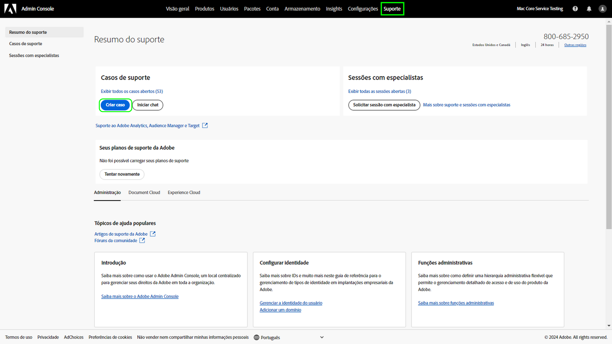

# Experiência de Suporte ao cliente da Adobe

## Tíquetes de suporte do Admin Console

Agora, os tíquetes de suporte podem ser enviados pelo [Admin Console](https://adminconsole.adobe.com/). Para obter instruções sobre como enviar um tíquete de suporte, consulte a seção de [envio de um tíquete de suporte](#submit-ticket).

Estamos trabalhando para melhorar a interação com o Suporte ao cliente do Adobe. Nosso objetivo é simplificar a experiência de suporte, mudando para um ponto de acesso centralizado, usando o Adobe Admin Console. Assim que o novo Suporte ao cliente da Adobe estiver funcionando, sua organização terá uma maior visibilidade do histórico de serviços em um mesmo sistema para os produtos e poderá solicitar ajuda por telefone, chat ou site, tudo em um só portal.

## Como enviar um tíquete de suporte do Admin Console {#submit-ticket}

Para enviar um tíquete de suporte no [Admin Console](https://adminconsole.adobe.com/), é necessário que um Administrador do sistema atribua a função de administrador de suporte a você. Somente um Administrador de sistema da sua organização pode atribuir essa função. Produto, Perfil de produto e outras funções administrativas não podem atribuir a função de administrador de suporte e não conseguem visualizar a opção **[!UICONTROL Criar caso]** usada para enviar um tíquete de suporte. Para obter mais informações, visite a documentação sobre [atendimento ao cliente de empresas e equipes](customer-care.md).

### Atribuir a função de administrador de suporte

A função de administrador de suporte é uma função não administrativa que tem acesso a informações relacionadas ao suporte. Os administradores de suporte podem visualizar, criar e gerenciar relatórios de problemas.

Para adicionar ou convidar um administrador:

1. No Admin Console, escolha **[!UICONTROL Usuários]** > **[!UICONTROL Administradores]**.
1. Clique em **[!UICONTROL Adicionar administrador]**.
1. Insira um nome ou endereço de email.

   Você pode pesquisar usuários existentes ou adicionar um novo usuário especificando um endereço de email válido e preenchendo as informações na tela.

   

1. Clique em **[!UICONTROL Próximo]**. Uma lista de funções de administrador é exibida.

Para atribuir uma função de administrador de suporte a um usuário (permitir que um usuário entre em contato com o suporte):

1. Selecione o **[!UICONTROL Administrador de suporte]** opção.

   

1. Escolha uma das duas opções a seguir:

   * Opção 1: **[!UICONTROL Administrador de suporte básico]**. Selecione essa opção se desejar conceder ao usuário suporte acesso a todas as soluções (exceto Marketo).
   * Opção 2: **[!UICONTROL Administrador de suporte do produto]**: selecione essa opção para obter suporte do Marketo. Selecione quais instâncias do Marketo devem receber acesso de suporte do usuário.

   

1. Depois de fazer as seleções, clique em **[!UICONTROL Salvar]**.

O usuário recebe um convite por email relacionado aos novos privilégios administrativos de `message@adobe.com`.

Os usuários devem clicar em **Começar** no email para se associarem à organização. Se os novos administradores não usarem o link **Começar** no convite por email, eles não conseguirão acessar o Admin Console.

Como parte do processo de login, os usuários podem ser solicitados a configurar um perfil da Adobe, caso ainda não tenham um. Se os usuários tiverem vários perfis associados ao seu endereço de email, eles deverão escolher **Ingressar na equipe** (se solicitado) e selecione o perfil associado à nova organização.

### Criar um tíquete de suporte com o Admin Console

Para criar um tíquete usando o [Admin Console](https://adminconsole.adobe.com/), selecione a guia **[!UICONTROL Suporte]** localizada na navegação superior. A página [!UICONTROL Resumo do suporte] será exibida. Em seguida, selecione a opção **[!UICONTROL Criar caso]**.

>[!TIP]
>
> Se você não conseguir ver a opção **[!UICONTROL Criar caso]** ou a guia **[!UICONTROL Suporte]**, entre em contato com um Administrador do sistema para que ele atribua a função de administrador de suporte a você.

Uma caixa de diálogo será exibida para que você selecione um tipo de problema. Selecione o tipo que melhor descreva seu problema ou pergunta e selecione **[!UICONTROL Criar caso]** na parte inferior direita.

A caixa de diálogo **[!UICONTROL Criar caso]** será exibida. Você deve fornecer algumas informações, como produto, prioridade e descrição, e anexar quaisquer capturas de tela que possam ajudar a descrever o problema. Selecione **[!UICONTROL Próximo]** para continuar.

>[!NOTE]
>
> Se o problema resultar em paralisações ou interrupções extremamente graves em um sistema de produção, será fornecido um número de telefone para assistência imediata.

A próxima página permite que você preencha as informações de contato e forneça o melhor horário para que o Suporte ao cliente do Adobe entre em contato com você. Depois de concluir, selecione **[!UICONTROL Enviar]** na parte inferior direita, e seu tíquete será enviado ao Suporte ao cliente da Adobe.

<!--

## What About the Legacy Systems?

New Tickets/Cases will no longer be able to be submitted in legacy systems as of May 11th.  The [Admin Console](https://adminconsole.adobe.com/) will be used to submit new tickets/cases.

### Existing Tickets/Cases

* Between May 11th and May 20th the legacy systems will remain available to work existing tickets/cases to completion.
* Beginning May 20th the support team will migrate remaining open cases from the legacy systems to the new support experience.  You will receive an email notification regarding how to contact support to continue to work these cases.
-->
