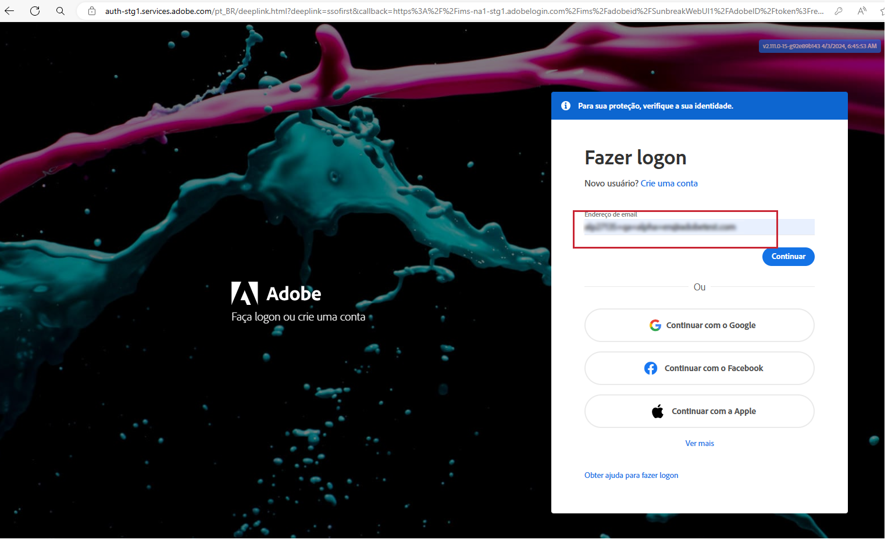
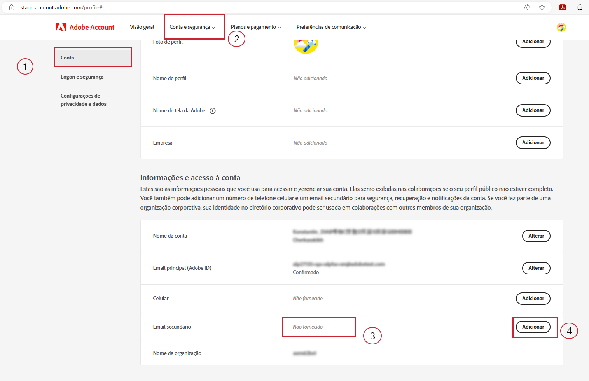
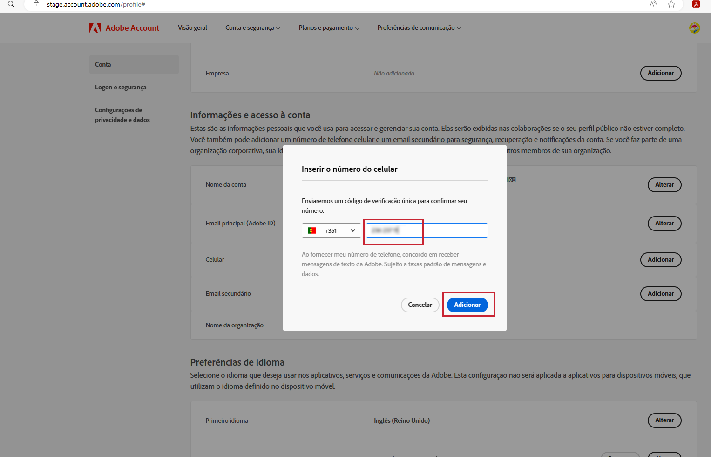
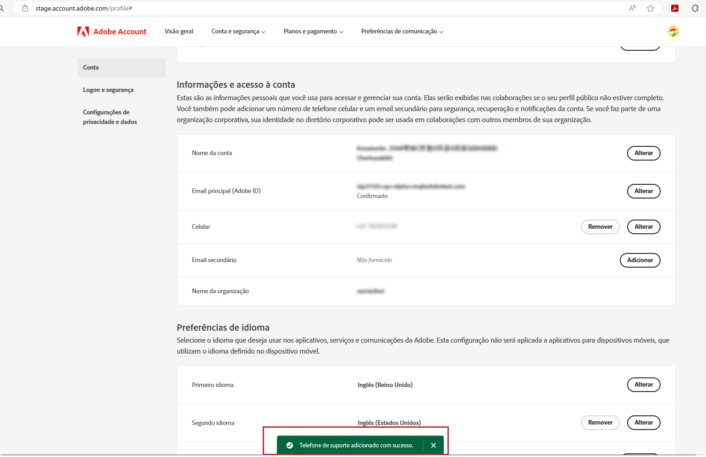

# Especifique um número de telefone de suporte de sua preferência.

Quando uma função de &quot;Administrador&quot; é atribuída a você, como &quot;Administrador de suporte do produto&quot;, você receberá um email informando que tem direitos de &quot;Administrador&quot; para gerenciar a instância para a qual recebeu direitos de administrador.

O email agora contém o texto abaixo em vermelho, que explica como acessar o perfil da sua conta e compartilhar conosco o número de telefone de suporte de sua preferência.

Para especificar o número de telefone de sua preferência:

1. Clique no link **Perfil da conta** para abrir uma nova janela e fazer logon usando `account.adobe.com`.

   

1. Siga o processo de logon e acesse a tela abaixo em `account.adobe.com`.
1. Em seguida, clique nas guias abaixo Conta e segurança > Conta para ver o campo Número de telefone de suporte.
1. Adicione aqui um número de telefone que você gostaria que usássemos para reconhecê-lo de acordo com suas necessidades de suporte.

